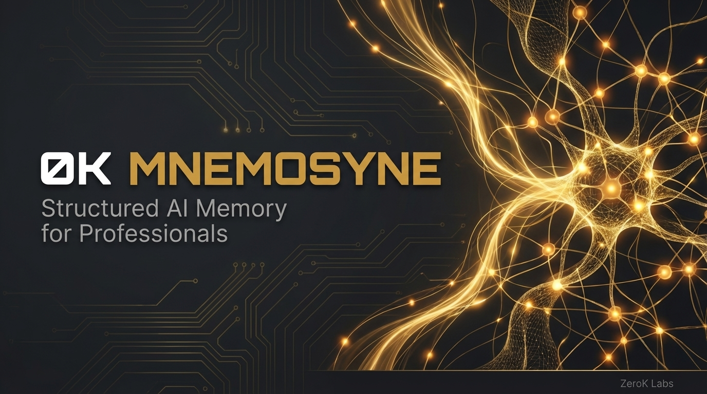

<p align="center">
  
</p>

<p align="center">
  <strong>Structured AI memory for professionals. 100% local. Zero cloud. Security-first.</strong>
</p>

<p align="center">
  <a href="https://github.com/0K-cool/mnemosyne/blob/main/LICENSE"></a>
  
  
  
  
  
  
</p>

# Mnemosyne

By [ZerOK Labs](https://zeroklabs.ai) — part of the 0K product suite.

---

## Table of Contents

- [Install](#install)
- [What You Get](#what-you-get)
- [How It Works](#how-it-works)
- [Architecture](#architecture)
- [Benchmark](#benchmark)
- [Security](#security)
- [Optional: Enhanced Retrieval](#optional-enhanced-retrieval)
- [Test Suite](#test-suite)
- [License](#license)

---

## Install

```
claude plugins install mnemosyne
```

That's it. Zero dependencies. Works immediately.

## What You Get

- **Auto-save** — memories saved on session end, even if the AI forgets
- **Auto-retrieve** — relevant memories injected into every prompt
- **Self-improvement** — `/gotcha` captures mistakes at the source
- **Session mining** — `/mine-session` extracts learnings from past conversations
- **Memory validation** — L3 anti-poisoning blocks injection attempts (adversarial-tested, 53 test cases)
- **Templates** — starter `MEMORY.md`, `identity.txt`, and `memory/` directory

## How It Works

Each component has one job. No overlap. Clear boundaries.

| Component | Role | Analogy |
|---|---|---|
| `identity.txt` | 100-token cold-start context | Your handshake |
| `MEMORY.md` | Index of what memories exist | Your table of contents |
| `memory/` files | Long-term storage — decisions, feedback, learnings | Your journal |
| `/gotcha` | Captures mistakes at the source | Your error log |
| `lessons-learned.md` | What went wrong and why | Your scar tissue |
| Auto-save hook | Mechanical enforcement — saves even if AI forgets | Your backup alarm |
| `/mine-session` | Extracts value from past conversations | Your archivist |
| L3 validation | Blocks poisoning, injection, data stuffing | Your immune system |

With optional [0k-rag](https://github.com/0K-cool/0k-rag):

| Component | Role | Analogy |
|---|---|---|
| 0k-rag | Hybrid semantic search across all indexed knowledge | Your library |

**Design principle:** The journal doesn't search. The library doesn't store decisions. The immune system doesn't retrieve. Each piece does one thing well.

## Architecture

```
INSTALL (zero-dep)          + 0k-rag (optional)
========================    ========================
identity.txt ──► cold-start
MEMORY.md ──► keyword index
memory/ ──► file storage
hooks/ ──► auto-save,        0k-rag ──► vector + BM25
           auto-retrieve,              + RRF + BGE
           memory-validation            reranking
skills/ ──► /gotcha,
            /mine-session

Retrieval: keyword search ──► OR ──► hybrid semantic search
           (40% R@5, 0 deps)         (100% R@5, ~2.5GB)
```

## Benchmark

Tested on [LongMemEval](https://arxiv.org/abs/2410.10813) (470 questions, per-question indexing). [MemPalace](https://github.com/MemPalace/mempalace) is included as a reference — it's the most popular Claude Code memory plugin and publishes LongMemEval results using the same methodology.

| Configuration | Session R@5 | Turn R@5 | MRR | Dependencies |
|---|:---:|:---:|:---:|---|
| Mnemosyne alone | 40.0% | — | 31.5% | Zero |
| Mnemosyne + 0k-rag (full) | **100.0%** | **91.5%** | **74.3%** | ~2.5GB |
| MemPalace (raw ChromaDB) | 96.6% | — | — | chromadb |
| MemPalace (hybrid v4, no LLM) | 98.4% | — | — | chromadb + tuning |

**Methodology:** Per-question oracle indexing — identical to MemPalace's published methodology. Each question gets a fresh index containing only its haystack sessions. Same dataset, same metrics, same evaluation protocol.

**What the numbers mean:**
- **Session R@5:** Did the top-5 results include the correct conversation? (session-level)
- **Turn R@5:** Did the top-5 results include the exact correct turn? (turn-level, harder)
- **MRR:** How high did the first correct result rank? (1.0 = first position)

**The zero-dep tier** (40% R@5) is keyword matching against a markdown index — no models, no embeddings, no dependencies. It works offline, on any machine, instantly. For professionals who need memory but can't install ML models on hardened systems, this is the floor.

**The full tier** (100% R@5) uses hybrid vector + BM25 + reciprocal rank fusion + BGE reranking. All local, zero API calls, zero cloud.

## Security

Mnemosyne includes an L3 anti-poisoning hook that blocks memory injection attempts at write time.

**What it catches:**
- Prompt injection patterns ("ignore previous instructions", "you are now", `<system>`)
- Privilege escalation ("act as admin", "override policies")
- Context manipulation ("forget previous", "do not follow rules")
- Oversized writes (>50KB data stuffing)
- Unicode normalization bypass (NFKC + zero-width character stripping)

**What it doesn't catch** (known limitations, documented in tests):
- Cyrillic homoglyph substitution (NFKC doesn't equate cross-script characters)
- Base64/URL-encoded payloads (opaque text, not decoded)
- Legitimate content quoting injection patterns (security research notes will trigger — security > convenience)

**Test coverage:** 106 tests total. The adversarial suite alone has 53 test cases covering contract validation, every regex pattern, unicode/whitespace/encoding bypass attempts, and false-positive prevention.

For comparison: MemPalace has zero memory validation. No injection detection, no size limits, no content scanning.

## Optional: Enhanced Retrieval

For full retrieval accuracy, add 0k-rag:

```
/mnemosyne-setup-rag
```

This guided setup installs [0k-rag](https://github.com/0K-cool/0k-rag) — a hybrid semantic retrieval engine. Requires Ollama and ~2.5GB disk space.

| Tier | What You Get | Size |
|---|---|---|
| **Zero-dep** (default) | Keyword search against MEMORY.md index + file content | 0 MB |
| **Full** (0k-rag) | Vector (nomic-embed-text) + BM25 + RRF + BGE reranker | ~2.5 GB |

The plugin auto-detects which tier is available and uses the best one.

## Test Suite

```bash
make test          # Run all 106 tests
make test-fast     # Unit + adversarial only (<1s)
make test-integration  # Hook I/O + plugin structure
```

| Suite | Framework | Tests | What It Covers |
|---|---|:---:|---|
| `test_markdown_retriever.py` | Python unittest | 18 | Two-pass keyword retrieval algorithm |
| `test_auto_retrieve.py` | Python unittest | 20 | RAG detection, memory dir walk, rate limiting |
| `test_memory_validation.ts` | Bun test | 53 | Adversarial L3 anti-poisoning (contract + bypass + false-positive) |
| `test_integration.py` | Python unittest | 6 | Dual-mode detection, plugin structure |
| `test_hook_io.py` | Python unittest | 9 | Subprocess JSON contracts for all 4 hooks |

## License

MIT

