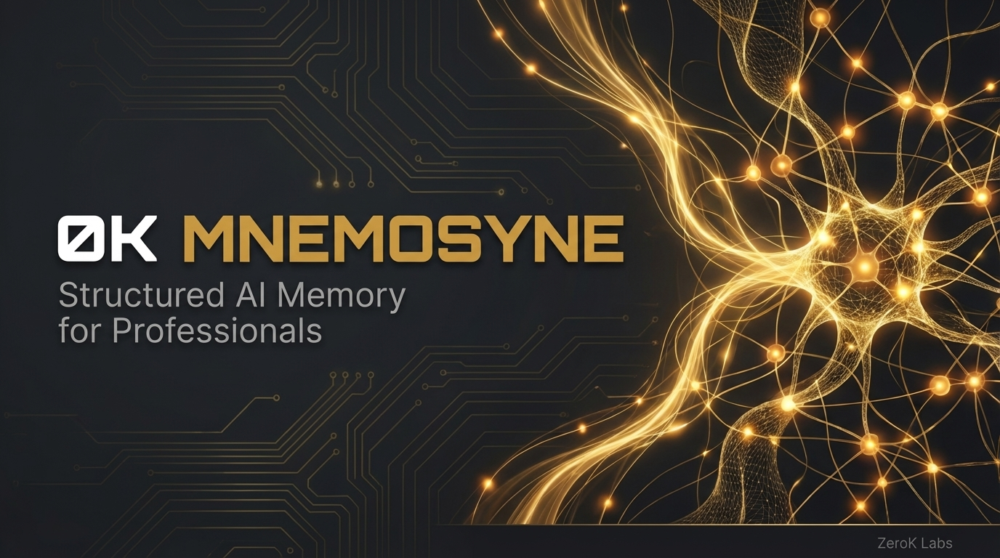

<p align="center">
  
</p>

<p align="center">
  <strong>Structured AI memory plugin for Claude Code. 100% local. Zero cloud. Security-first.</strong>
</p>

<p align="center">
  
  <a href="https://github.com/0K-cool/mnemosyne/blob/main/LICENSE"></a>
  
  
  
  
  
  
  
</p>

# Mnemosyne

By [ZerOK Labs](https://zeroklabs.ai) — part of the 0K product suite.

---

## Table of Contents

- [Install](#install)
- [What You Get](#what-you-get)
- [How It Works](#how-it-works)
- [Memory-Driven Enforcement (v2)](#memory-driven-enforcement-v2)
- [Architecture](#architecture)
- [Benchmark](#benchmark)
- [Security](#security)
- [Optional: Enhanced Retrieval](#optional-enhanced-retrieval)
- [Test Suite](#test-suite)
- [License](#license)

---

## Install

**Platform:** macOS (Apple Silicon optimized). Windows support planned.

```
claude plugins install mnemosyne
```

That's it. Zero dependencies. Works immediately.

## What You Get

- **Auto-save** — memories saved on session end, even if the AI forgets
- **Auto-retrieve** — relevant memories injected into every prompt
- **Time-aware ranking (v2.2.0)** — fresh, frequently-used memories rank higher. A small additive recency bonus breaks ties without ever burying an older relevant memory (so changing facts surface their *current* value), and it auto-disables for "when did I…" temporal queries. Ships alongside a BM25 scoring fix worth **+24.9 Recall@5** on a high-distractor benchmark. ([Benchmark](#benchmark))
- **Memory-driven enforcement (v2.0.0)** — memory entries with an `enforce:` block generate Claude Code hooks that **hard-block at the tool boundary**. The agent cannot rationalise its way around the rule because the runtime intercepts before the tool runs. ([How](#memory-driven-enforcement-v2))
- **Self-improvement** — `/gotcha` captures mistakes at the source
- **Session mining** — `/mine-session` extracts learnings from past conversations
- **Memory validation** — L3 anti-poisoning blocks injection attempts (adversarial-tested, 100 test cases including homoglyph and encoding bypass)
- **Templates** — starter `MEMORY.md`, `identity.txt`, and `memory/` directory

## How It Works

Each component has one job. No overlap. Clear boundaries.

| Component | Role | Analogy |
|---|---|---|
| `identity.txt` | 100-token cold-start context | Your handshake |
| `MEMORY.md` | Index of what memories exist | Your table of contents |
| `memory/` files | Long-term storage — decisions, feedback, learnings | Your journal |
| `.reinforcement.jsonl` | Usage ledger (v2.2) — fresh, often-used memories rank higher; never deletes | Your muscle memory |
| `/gotcha` | Captures mistakes at the source | Your error log |
| `lessons-learned.md` | What went wrong and why | Your scar tissue |
| Auto-save hook | Mechanical enforcement — saves even if AI forgets | Your backup alarm |
| `/mine-session` | Extracts value from past conversations | Your archivist |
| L3 validation | Blocks poisoning, injection, data stuffing | Your immune system |

With optional [0K-RAG](https://github.com/0K-cool/0k-rag):

| Component | Role | Analogy |
|---|---|---|
| 0K-RAG | Hybrid semantic search across all indexed knowledge | Your library |

**Design principle:** The journal doesn't search. The library doesn't store decisions. The immune system doesn't retrieve. Each piece does one thing well.

## Memory-Driven Enforcement (v2)

> "CLAUDE.md content is delivered as a user message after the system prompt, not as part of the system prompt itself. Claude reads it and tries to follow it, but **there's no guarantee of strict compliance**."
> — [Anthropic, code.claude.com/docs/en/memory](https://code.claude.com/docs/en/memory)

Mnemosyne v1 makes memory *recallable*. v2 makes it *enforceable*. When a memory entry declares an `enforce:` block, Mnemosyne can generate a Claude Code hook that intercepts the matching tool call at the runtime boundary — a layer Anthropic's docs confirm IS enforced regardless of what the agent rationalises.

```yaml
---
name: no-force-push-to-main
type: feedback
description: |
  Force-pushing to main rewrites shared history. Catastrophic on a
  team; merely embarrassing on a solo project. Block before, not after.
enforce:
  tool: Bash
  pattern: "git push --force"
  hook: .claude/hooks/auto/force-push-guard.ts
  generated_from: memory/feedback_no_force_push_main.md
  protected_branches: [main, master]
---

Body text — the rule prose for human readers and recall.
```

```bash
PYTHONPATH=lib python -m enforce \
  --memory-dir memory \
  --output-dir .claude/hooks/auto

# → Writes .claude/hooks/auto/force-push-guard.ts
# → Claude Code loads it on next session start
# → `git push --force origin main` is now hard-blocked
```

### Templates

| Template | What it gates | Languages |
|---|---|:---:|
| `cr-prepush-guard` | `git push` until a fresh CodeRabbit review is on file (configurable freshness window + optional repo filter) | ts |
| `block-on-match-guard` | Pattern matches (`rm -rf /`, destructive SQL, etc.) — hard block, or soft warn via `mode: warn` (v2.1.0) | ts • py • sh |
| `force-push-guard` | `git push --force` to protected branches (default: `main`, `master`) | ts |
| `credential-leak-guard` | `Edit` / `Write` / `MultiEdit` writes containing AWS keys, GitHub PATs, Slack tokens, PEM private keys, Stripe live keys, npm / GitLab tokens | ts |

Tool-aware templates parse arguments rather than relying on regex alone — `force-push-guard` tokenises `git push` properly so `git -c k=v push --force ...` and `git push --force origin HEAD:refs/heads/main` are both caught (both are real bypass surfaces v1 regex would miss).

### Multi-language support

Default emit language is TypeScript (zero-dep on bun). Set `language: py` or `language: sh` in the `enforce:` block to emit a stdlib-only Python hook or a `jq`-based shell hook instead.

### Soft-to-hard escalation (v2.1.0)

Rules can start as nudges and earn their teeth. A `mode: warn` rule
allows the action but shows a warning, re-injects the rule text as
`additionalContext` (the agent sees its own rule at the moment of
bypass), and audits `warn`. Declare an `escalation:` policy and the
audit aggregator promotes persistent offenders to a hard block — with
your approval:

```yaml
enforce:
  tool: Bash
  pattern: "gh pr create"
  hook: .claude/hooks/auto/pr-rate.ts
  generated_from: memory/feedback_api_batching.md
  template: block-on-match-guard.ts.template
  mode: warn                # soft tier: warn + audit + allow
  escalation:
    threshold: 3            # warn events ...
    window_days: 7          # ... inside this rolling window
```

```bash
PYTHONPATH=lib python -m enforce.audit --memory-dir memory
# → 🔺 READY TO ESCALATE — pr-rate: 3 warn(s) in 7d (threshold 3)

PYTHONPATH=lib python -m enforce.audit --apply
# → [y/N] per rule: flips `mode: warn` → `mode: block` in the memory
#   entry (the rule stays the single source of truth) and regenerates
#   the hook. Next bypass attempt is blocked.
```

Cron-friendly: `--fail-on-escalation` exits 3 when something is READY;
`--webhook-url` (or `MNEMOSYNE_WEBHOOK_URL`) POSTs a Discord-compatible
notification per READY rule. Promotion is operator-gated by default —
audit logs are inputs an attacker could append to, so a human stays in
the loop (escalation can only ever *tighten* enforcement, never loosen
it).

Retirement is the same contract in reverse: `python -m enforce --sync`
finds generated hooks whose source rule was archived or deleted and
offers a gated cleanup — provenance-checked (hand-written files are
never touched), audit history preserved.

### What it doesn't do

- **Only the rules you wire** — entries without an `enforce:` block stay recall-only.
- **Tool boundary only** — hooks fire on tool calls, not on agent reasoning. An agent can still draft a bad plan; it just can't execute the gated action.
- **Architectural bypasses** are documented limits: Claude Code subagent calls bypass PreToolUse hooks ([#21460](https://github.com/anthropics/claude-code/issues/21460)), MCP tool calls have their own surface, `@file` mentions sidestep hook gates. Mnemosyne v2 is one defense-in-depth layer, not a silver bullet.
- **Pattern fragility is real** — a regex-only template can be evaded by command normalisation. The shipped templates layer arg parsing on top of regex to close the most common bypass classes, but new ones will surface.

Full design: [`docs/v2-enforcement.md`](docs/v2-enforcement.md).

## Architecture

```text
INSTALL (zero-dep)             v2 ENFORCE (opt-in)         + 0K-RAG (optional)
============================   ==========================  ============================
identity.txt ──► cold-start    enforce: ──► generator ──►
MEMORY.md ──► keyword index    .claude/hooks/auto/
memory/ ──► file storage         <rule>.<lang>          0K-RAG ──► vector + BM25
hooks/ ──► auto-save,                                              + RRF + BGE
           auto-retrieve,      Templates:                          reranking
           memory-validation     cr-prepush-guard
skills/ ──► /gotcha,             block-on-match-guard
            /mine-session        force-push-guard
                                 credential-leak-guard
                               Languages: ts | py | sh

Retrieval: BM25 + stemming + ──► OR ──► vector + BM25 + RRF ──► OR ──► + BGE reranking
           time-aware ranking           (100% R@5, core)              (100% R@5, full)
           (80% R@5, 0 deps)

Enforcement (opt-in per memory entry):
   memory entry { enforce: } ──► python -m enforce ──► PreToolUse hook ──► tool boundary block
```

## Benchmark

Tested on [LongMemEval](https://arxiv.org/abs/2410.10813) (470 questions, per-question indexing). [MemPalace](https://github.com/MemPalace/mempalace) is included as a reference — it's the most popular Claude Code memory plugin and publishes LongMemEval results using the same methodology.

| Configuration | Session R@5 | Turn R@5 | MRR | Dependencies |
|---|:---:|:---:|:---:|---|
| Mnemosyne alone | 80.2% | — | 59.3% | Zero |
| Mnemosyne + 0K-RAG core | **100.0%** | **93.0%** | 70.0% | Ollama + LanceDB |
| Mnemosyne + 0K-RAG full | **100.0%** | 91.5% | **74.3%** | Ollama + LanceDB + BGE reranker |
| MemPalace (raw ChromaDB) | 96.6% | — | — | chromadb |
| MemPalace (hybrid v4, no LLM) | 98.4% | — | — | chromadb + tuning |

**Methodology:** Per-question oracle indexing — identical to MemPalace's published methodology. Each question gets a fresh index containing only its haystack sessions. Same dataset, same metrics, same evaluation protocol.

**What the numbers mean:**
- **Session R@5:** Did the top-5 results include the correct conversation? (session-level)
- **Turn R@5:** Did the top-5 results include the exact correct turn? (turn-level, harder)
- **MRR:** How high did the first correct result rank? (1.0 = first position)

**A note on methodology:** Per-question benchmarks create a small, isolated corpus per question (~20-30 turns). All systems score high here because the search space is small. Real-world memory collections grow to hundreds of sessions. We publish both numbers so you can judge for yourself:

| Scenario | Mnemosyne + 0K-RAG | Corpus Size |
|---|:---:|---|
| Per-question (benchmark) | 100.0% R@5 | ~22 turns per question |
| Shared index (real-world) | 86.4% R@5 | 10,866 turns, single index |

The shared-index number reflects what actually happens when your memory has months of accumulated conversations. We believe this is the number that matters.

**The zero-dep tier** (80.2% R@5) uses BM25 scoring with suffix stemming against a markdown index, plus v2.2 time-aware ranking (a small additive recency bonus) — no models, no embeddings, no dependencies. It works offline, on any machine, instantly. For professionals who need memory but can't install ML models on hardened systems, this is a strong baseline.

**The core tier** (100% R@5, 93% turn-level) uses vector + BM25 + reciprocal rank fusion. Hits perfect session-level recall without a reranker. Best turn-level accuracy of any configuration.

**The full tier** (100% R@5, 74.3% MRR) adds BGE reranking on top. Same session-level recall as core, but better ranking of correct results (higher MRR). All local, zero API calls, zero cloud.

### Beyond LongMemEval — three more public benchmarks

The numbers above use the per-question oracle methodology MemPalace headlines on. We also ran three additional public benchmarks where the comparison gets more interesting. All three results below use Mnemosyne's zero-dependency keyword retriever (the markdown tier) — no embeddings, no LLM, no API key. Reference numbers are from MemPalace's own published / committed results.

#### MemBench (ACL 2025) — 7,500 items across 7 categories

[MemBench](https://aclanthology.org/2025.findings-acl.989/) is a peer-reviewed multi-turn conversation memory benchmark. MemPalace ran it (April 14, 2026) and committed `results_membench_hybrid_all_movie_top5_*.json` to their repo, but did not list MemBench in their published `benchmarks/README.md`. The comparison below uses their committed numbers:

| Category | N | Mnemosyne hit@5 | MemPalace hit@5 | Δ |
|---|:---:|:---:|:---:|:---:|
| simple | 1000 | **95.7%** | — | — |
| noisy | 1000 | **77.0%** | 43.4% | **+33.6** |
| highlevel | 1500 | 67.9% | — | — |
| knowledge_update | 1000 | 93.7% | — | — |
| comparative | 1000 | **99.7%** | 98.4% | +1.3 |
| conditional | 1000 | **89.7%** | 57.3% | **+32.4** |
| aggregative | 1000 | 88.2% | 99.3% | −11.1 |
| **Overall** | **7500** | **86.1%** | ~80.3% | **+5.8** |

`aggregative` is an honest loss — dense embeddings beat keyword retrieval on cross-turn synthesis. The two categories MemPalace declined to publicize (`noisy`, `conditional`) are also the two where their hybrid struggles and our keyword retriever wins decisively.

At top-1: Mnemosyne **48.2%** overall hit@1 across the same 7,500 items.

#### LoCoMo (1,986 multi-hop QA pairs)

[LoCoMo](https://github.com/snap-research/locomo) tests memory across 10 long conversations (19–32 sessions, 400–600 turns each).

| top-k | Mnemosyne R@k | MemPalace R@k (no rerank) | Δ |
|:---:|:---:|:---:|:---:|
| 5 | 53.4% | not published | — |
| 10 | 61.1% | 60.3% | **+0.8** |
| 50 | 73.2% | not published | — |

At top-10 the zero-dep keyword retriever now edges *ahead* of MemPalace's hybrid (+0.8pp). The +12pp jump from top-10 to top-50 illustrates the structural easing that comes with retrieving more candidates. Worth flagging: MemPalace's LoCoMo bench script default is `--top-k 50` while their public README example invokes `--top-k 10`; their published 60.3% is the top-10 number, but operators copying the default get the much-easier top-50 setup. We publish at top-5, top-10, and top-50 so the comparison is unambiguous.

#### LongMemEval `_s_cleaned` (hard mode, 470 questions)

The harder LongMemEval split that MemPalace's headline 96.6% is computed against. Each question carries ~53 distractor sessions (vs ~13 on the oracle dataset).

| Tier | Mnemosyne R@5 | Mnemosyne R@10 |
|---|:---:|:---:|
| Markdown (zero-dep) | 68.9% | 81.5% |

The honest number: keyword retrieval still lands below dense embeddings (MemPalace's 96.6%) under `_s_cleaned`'s noise level — but the v2.2 BM25 scoring fix **nearly doubled it, from 44.3% to 68.9% R@5**, by no longer flattening strong matches into a tie at the top of the ranking. For top accuracy at this difficulty, install 0K-RAG. (Hard-mode core/full numbers will land in a follow-up release once the comparison run completes.)

## Security

Mnemosyne includes an L3 anti-poisoning hook that blocks memory injection attempts at write time.

**What it catches:**
- Prompt injection patterns ("ignore previous instructions", "you are now", `<system>`)
- Privilege escalation ("act as admin", "override policies")
- Context manipulation ("forget previous", "do not follow rules")
- Oversized writes (>50KB data stuffing)
- Unicode normalization bypass (NFKC + zero-width character stripping)
- Cyrillic/Greek homoglyph substitution (confusables mapping for ~30 cross-script character pairs)
- Base64-encoded payloads (decoded and scanned if valid UTF-8 text)
- URL-encoded payloads (percent-decoded before pattern matching)

**What it doesn't catch** (known limitations, documented in tests):
- Legitimate content quoting injection patterns (security research notes that quote attack strings will trigger — this is by design: security > convenience, and the cost of a false negative outweighs the cost of a false positive)
- Novel patterns not yet in the rule set (the ruleset is updated as new techniques surface; see [SECURITY.md](SECURITY.md) for the threat-model boundary)

(HTML-entity encoding `&#105;gnore` was an earlier limitation — v1.1.0 added a numeric + small-named-entity decoder, MED-2 in the audit, so it IS now caught alongside the URL-encoded variants.)

**Test coverage:** 510 tests total (410 Python + 100 bun). The adversarial bun suite alone has 100 test cases covering contract validation, every regex pattern, homoglyph substitution, encoding bypass attempts, and false-positive prevention. `test_content_scanner.py` mirrors the same 56 cases at read time on retrieved chunks (defense in depth — same patterns, both write-time and read-time).

For comparison: MemPalace has zero memory validation. No injection detection, no size limits, no content scanning.

**Defense-in-depth:** Mnemosyne guards file system writes to memory. For broader coverage, consider [0K-Talon](https://github.com/0K-cool/0k-talon) — a security plugin that guards MCP Memory Server operations, code injection, egress, supply chain, and more. The two plugins have zero hook overlap and are tested to run together without conflicts.

## Optional: Enhanced Retrieval

For full retrieval accuracy, add 0K-RAG:

```
/mnemosyne-setup-rag
```

This guided setup installs [0K-RAG](https://github.com/0K-cool/0k-rag) — a hybrid semantic retrieval engine. Requires Ollama and ~3.7GB disk space.

| Tier | What You Get | Size |
|---|---|---|
| **Zero-dep** (default) | Keyword search against MEMORY.md index + file content | 0 MB |
| **Core** (0K-RAG, no reranker) | Vector (nomic-embed-text) + BM25 + RRF | ~2.5 GB |
| **Full** (0K-RAG) | Vector + BM25 + RRF + BGE reranker | ~3.7 GB |

The plugin auto-detects which tier is available and uses the best one.

## Test Suite

```bash
make test          # Run all 510 tests (410 Python + 100 bun)
make test-fast     # Unit + adversarial only (<1s)
make test-integration  # Hook I/O + plugin structure
```

| Suite | Framework | Tests | What It Covers |
|---|---|:---:|---|
| `test_markdown_retriever.py` | Python unittest | 23 | Two-pass keyword retrieval algorithm |
| `test_markdown_retriever_limits.py` | Python unittest | 8 | Retriever DoS guards (256KB cap, 5000-entry index ceiling) |
| `test_score_discrimination.py` | Python unittest | 6 | v2.2 BM25 cap-saturation fix: raw-score ranking, max-normalized display, discrimination under high IDF |
| `test_time_aware_ranking.py` | Python unittest | 16 | v2.2 time-aware ranking: half-life, temporal-query detection, search integration, reinforcement, staleness feed |
| `test_additive_recency.py` | Python unittest | 9 | v2.2 additive-λ recency tie-breaker: recency-signal math, strong-old-beats-weak-recent, bounded bonus |
| `test_reinforcement_ledger.py` | Python unittest | 10 | v2.2 usage sidecar: append-only record/aggregate, poisoned-ledger defenses (line/byte caps, schema validation) |
| `test_auto_retrieve.py` | Python unittest | 20 | RAG detection, memory dir walk, rate limiting |
| `test_auto_retrieve_security.py` | Python unittest | 30 | RAG path allowlist, importlib loader, untrusted-retrieved-memory delimiter |
| `test_content_scanner.py` | Python unittest | 56 | Read-time injection scanner (mirror of bun adversarial suite, applied to retrieved chunks) |
| `test_integration.py` | Python unittest | 10 | Dual-mode detection, plugin structure |
| `test_hook_io.py` | Python unittest | 9 | Subprocess JSON contracts for all 4 hooks |
| `test_enforce_schema.py` | Python unittest | 80 | v2 `enforce:` block validation: required fields, paths, strict char allow-list, ReDoS guard, regex compile, template / tool compatibility, injection fields, protected_branches, credential_patterns, language, mode, escalation policy |
| `test_enforce_generator.py` | Python unittest | 57 | v2 generator: parse, dispatch, render, per-context sanitisers, warn-mode emission, bun-build / `compile()` / `bash -n` smoke tests across all template + language combinations |
| `test_enforce_cli.py` | Python unittest | 19 | v2 `mnemosyne enforce` CLI: walk memory dir, idempotent regen, dry-run, single-rule mode, orphan reporting, symlink-safe atomic write, archive-dir skip + parse-failure classification (v2.1.1) |
| `test_enforce_audit.py` | Python unittest | 12 | v2 audit aggregator: per-rule counts, threshold escalation, JSON output |
| `test_enforce_escalation.py` | Python unittest | 28 | v2.1.0 soft-to-hard escalation: timestamp dialects, windowed warn counting, policy join, READY evaluation, gated apply (rewrite + revalidate + regenerate), webhook scheme allow-list + fail-soft, CLI exit codes |
| `test_enforce_sync.py` | Python unittest | 9 | v2.1.0 `--sync` retirement pass: provenance check, foreign-file guard, gated deletion, sidecar preservation |
| `test_enforce_skip_override.py` | Python unittest | 8 | Skip-override detection from `tool_input.command` (same-line prefix only), session-env path, behavioral subprocess runs against a throwaway git repo |
| `test_memory_validation.test.ts` | Bun test | 100 | Adversarial L3 anti-poisoning (contract + bypass + homoglyph + encoding + read-time scanner) |

**Total: 510 tests** (410 Python + 100 bun adversarial). The bun suite shells out to a separate runtime; both are wired into `make test`.

## License

[MIT](LICENSE)

